# DIU23
Prácticas Diseño Interfaces de Usuario 2022-23 

Grupo: DIU1_01AABB.  Curso: 2022/23 
Updated: 11/1/2023

Proyecto: 
Free Tour artesanía nazarí

Descripción: 

La empresa promocionará free tours donde además de la historia y arquitectura de granada se hará especial mención al arte y artesanía nazarí. Además en el mismo se hablará y promocionará la visita al taller de pago.

Logotipo: 
>>> Opcionalmente si diseña un logotipo para su producto en la práctica 3 pongalo aqui

Miembros
 * :bust_in_silhouette:   https://github.com/SamuS1906     :octocat:     
 * :bust_in_silhouette:  https://github.com/adriordi     :octocat:

----- 

<!-- >>> Este documento es el esqueleto del report final de la práctica. Aparte de subir cada entrega a PRADO, se debe actualizar y dar formato de informe final a este documento online. Elimine este texto desde la práctica 1 -->

# Proceso de Diseño 

## Paso 1. UX Desk Research & Analisis 

 1.a Competitive Analysis
-----

Dado que pertenecemos al grupo 3, se nos asignó el taller de artesanía nazarí. No existe competencia directa pues lo que ofrecen es único en la ciudad de Granada. Hay un estudio de arquitectura que ofrece también un taller pero no está ni indicado en su página web. Sin embargo, con respecto a las otras 2 páginas propuestas para la asignatura, esta tiene gran potencial en cuanto a contenido que promociona y vende. Por todo lo demás el menú de navegación tiene mapeo por el cual sabemos donde estamos al contrario de las otras dos, aunque no dejan de abrirse nuevas pestañas. Además la información está mucho mejor distribuida y satura menos que en las otras dos. Con una página web mejor organizada y más seria no podría ni compararse con ambas.

 1.b Persona
-----

Naroa, es una estudiante del grado de historia del arte en la UPV (Universidad del País Vasco). Tiene 23 años y vive en Bilbao pero este año ha venido a Granada para realizar su SICUE. Está encantada con la ciudad y toda su historia y al enterarse del taller por uno de sus profesores tiene muchas ganas de realizarlo.

Juan, es un profesor de historia del instituto Ángel Ganivet. Tiene 40 años y le gusta mucho buscar nuevas formas de transmitir a los alumnos su pasión por la historia.

 1.c User Journey Map
----

Hemos escogido estas dos experiencias de usuarios porque entendemos que, pese a buscar ambas lo mismo que es contratar el servicio, son a su vez distintas en cuanto a que no se enfrentan a los mismos problemas pero encuentran ambos las mismas problemáticas.

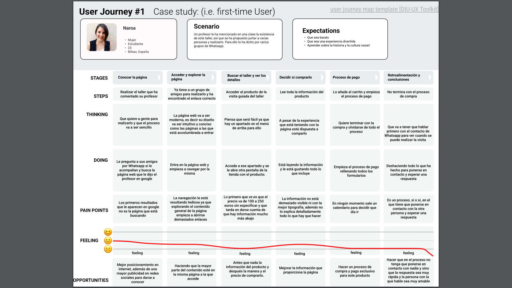

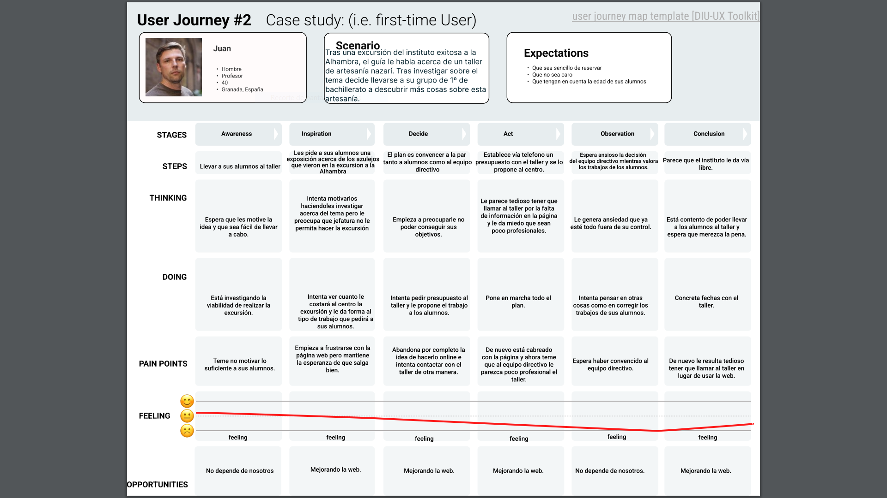

 1.d Usability Review
----

El documento se encuentra en el siguiente enlace [usability-review](/P1/P1/Usability-review-template.pdf).

La valoración final es de un 45 sobre 100 debido a que la página tiene muchas cosas en las que mejorar. Destacando el pobre acceso, la mala navegabilidad y la poca ayuda que esta ofrece a sus usuarios.

## Paso 2. UX Design  

 2.a Feedback Capture Grid / EMpathy map / POV
----

Hemos decidido generar una tabla con algunos POV entre los cuales se encuentran algunos muy parecidos a los que ofrecerían Naroa y Juan (turista y centro educativo):

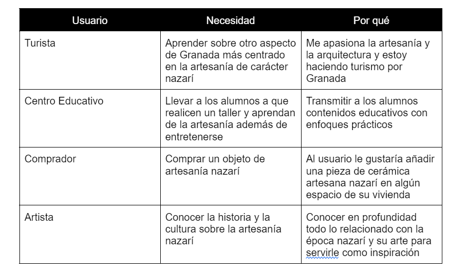

 2.b ScopeCanvas
----
Hemos recogido las propuestas de valor en el siguiente scope canvas. Asi las principales ideas se pueden reconocer a simple vista: 

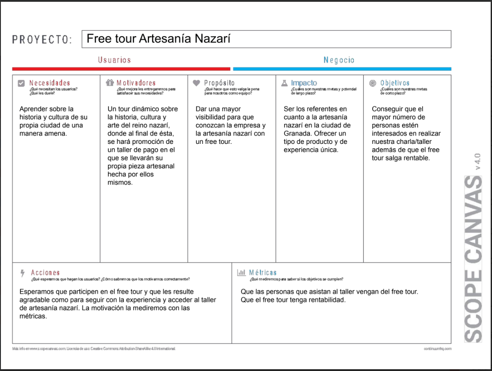

 2.b Tasks analysis 
-----

Para el analisis de las tareas hemos generado una malla receptora de información con los perfiles del POV que nos ha quedado de esta forma:

(Acceder al documento del siguiente enlace [U/T Matrix](/P2/POV%20y%20U_T%20matrix.pdf).)

 2.c IA: Sitemap + Labelling 
----

Este el sitemap que hemos generado:

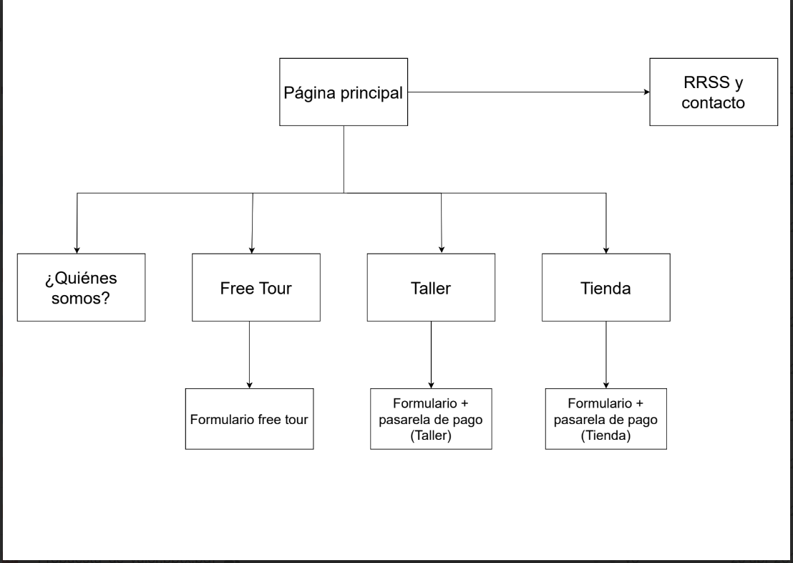

Y aquí mostramos el labelling del mismo:

 2.d Wireframes
-----

El diseño del layout lo puede visualizar junto con una breve explicación en el siguiente [pdf](/P2/Bocetos.pdf).

## Paso 3. Mi UX-Case Study (diseño)

 3.a Moodboard
-----

El diseño del moodboard queda así:

  3.b Landing Page
----

Este es nuestro planteamiento de landing page:

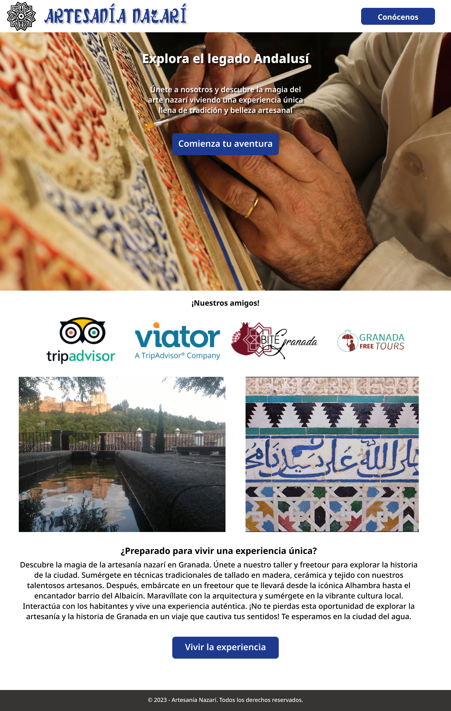

 3.c Guidelines
----

### Logotipo
Para el logotipo nos hemos inspirado en esta pieza de artesanía:
 
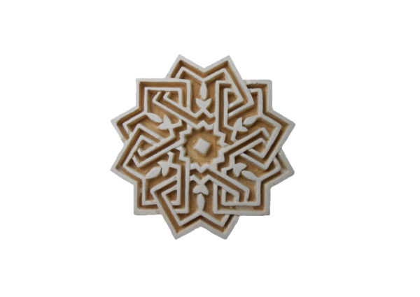

A la que le hemos dejado solo el delineado obteniendo además un toque más “artesanal” haciendo que este no fuera muy preciso.

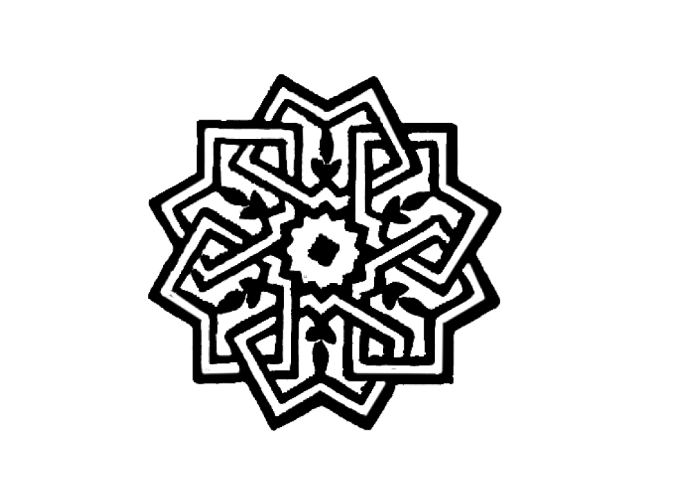

### Paleta de colores
Para los colores hemos planteado que sean similares a los que nos podemos encontrar en los azulejos de la Alhambra. Siendo principales el azul y blanco y como secundarios para puntos muy concretos los otros tres.

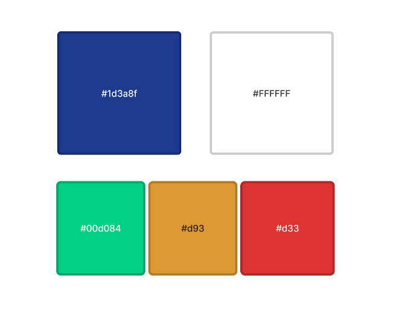

### Iconografía
Para los iconos nos hemos decantado por los que nos proporciona figma intentando buscar la simplicidad: que estos sean claros y concisos para que sean usables por cualquier tipo de persona. 
Para las imágenes hemos usado distintas páginas indiscriminadamente que nos proporcionan imágenes y fotografías sin derechos de autor.

### Tipografía
Las indicadas en el moodboard:  la fuente para el título es Arab Dances y para el resto de texto es Noto Sans.

### Patrón de diseño

Para el patrón de diseño nos hemos basado en una página de un hotel cuyo diseño nos ha parecido muy acertado y que podía encajar muy bien con el tipo de proyecto que estamos realizando. https://airelles.com/fr

  3.d Mockup
----

Intentando mantener el estilo de los bocetos y buscando cubrir la mayoría de puntos que necesita una página web para cumplir con un buen diseño UX/UI hemos realizado los siguientes mockup:

Página inicial:

Si abrimos el menu:

Si seleccionamos alguna de las opciones del menu:

Todos las opciones del menu guardan mucha similitud menos la tienda que se muestra así:
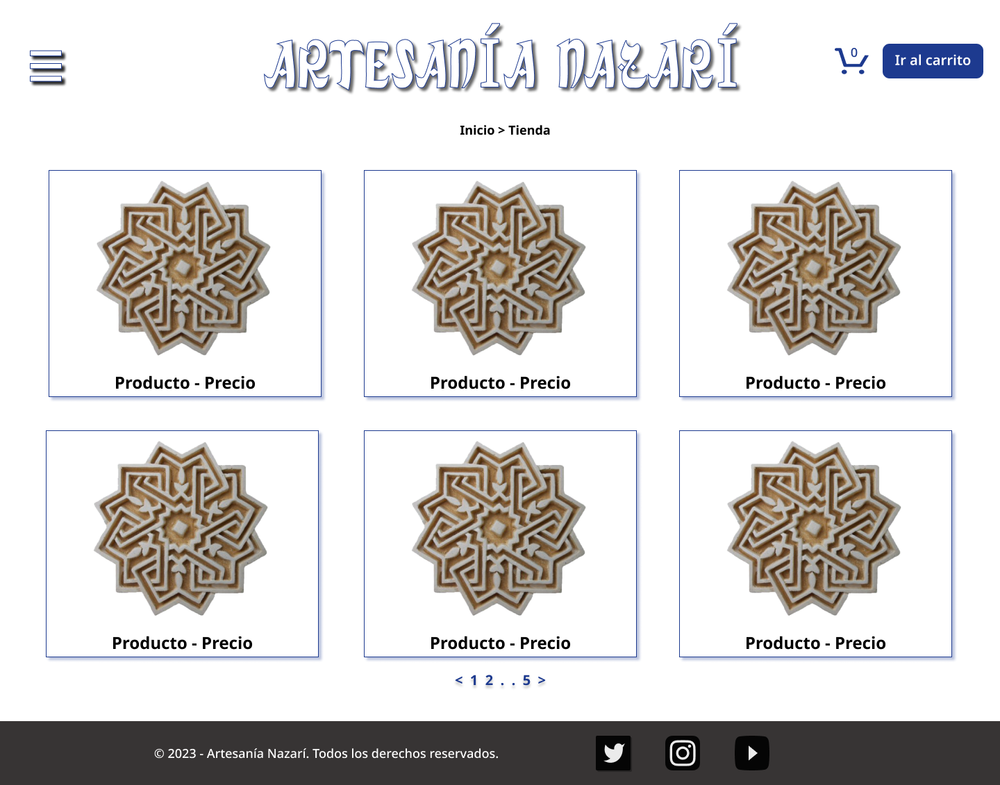

Si seleccionamos un producto:
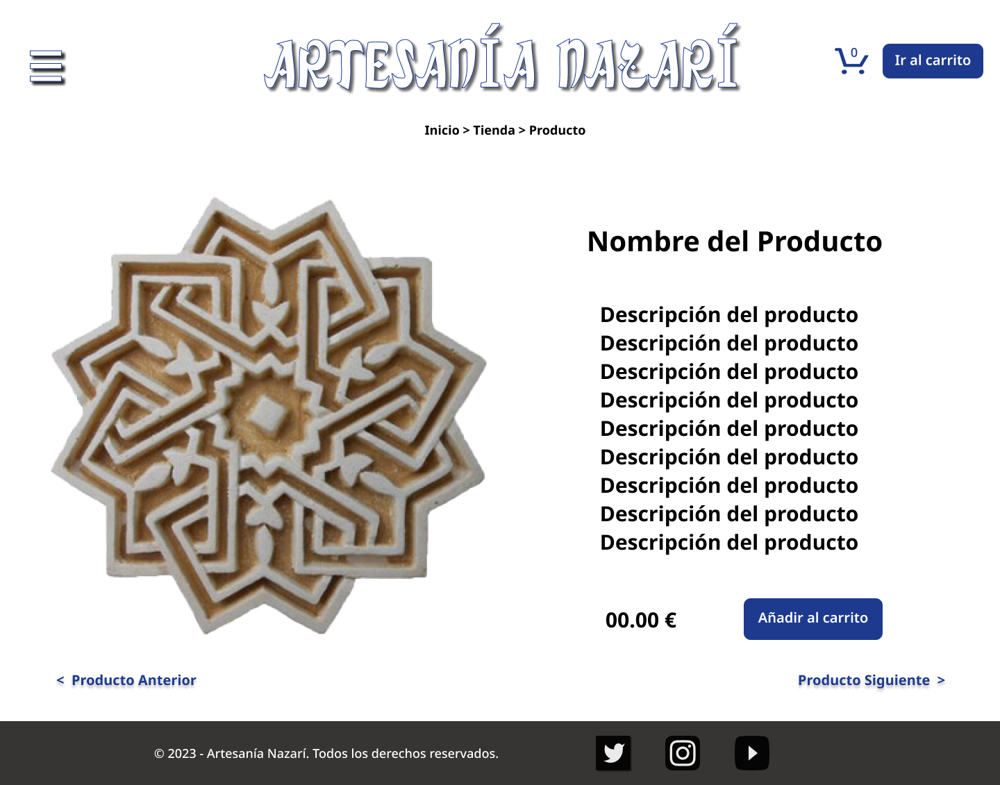

Si accedemos al carrito de productos seleccionados:
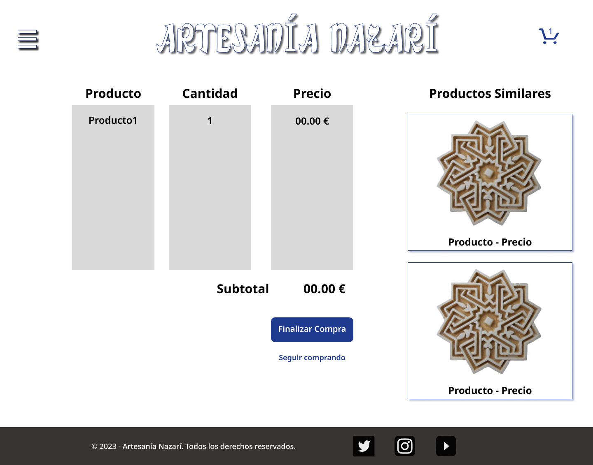

Esto nos lleva a un formulario de compra que tendrá el siguiente formato (este mismo formulario nos sirve para reservar visitas al taller o free tours y muestra o quita algunos campos en función de lo que se esté comprando):

Finalmente un detalle de la página de contacto:
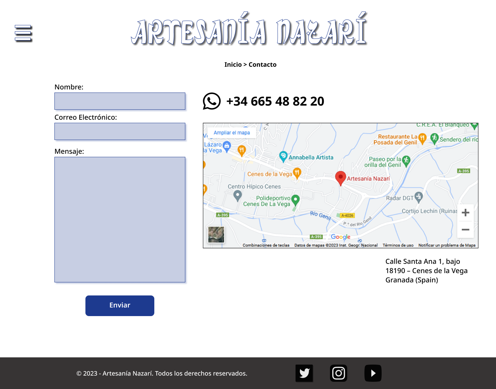

<!--  3.e ¿My UX-Case Study?
-----

>>> Publicar my Case Study en Github..
>>> Documente y resuma el diseño de su producto en forma de video de 90 segundos aprox -->

## Paso 4. Evaluación 

 4.a Caso asignado
----

>>> Breve descripción del caso asignado con enlace a  su repositorio Github

 4.b User Testing
----

>>> Seleccione 4 personas ficticias. Exprese las ideas de posibles situaciones conflictivas de esa persona en las propuestas evaluadas. Asigne dos a Caso A y 2 al caso B
 

| Usuarios | Sexo/Edad     | Ocupación   |  Exp.TIC    | Personalidad | Plataforma | TestA/B
| ------------- | -------- | ----------- | ----------- | -----------  | ---------- | ----
| User1's name  | H / 18   | Estudiante  | Media       | Introvertido | Web.       | A 
| User2's name  | H / 18   | Estudiante  | Media       | Timido       | Web        | A 
| User3's name  | M / 35   | Abogado     | Baja        | Emocional    | móvil      | B 
| User4's name  | H / 18   | Estudiante  | Media       | Racional     | Web        | B 

. 4.c Cuestionario SUS
----

>>> Usaremos el **Cuestionario SUS** para valorar la satisfacción de cada usuario con el diseño (A/B) realizado. Para ello usamos la [hoja de cálculo](https://github.com/mgea/DIU19/blob/master/Cuestionario%20SUS%20DIU.xlsx) para calcular resultados sigiendo las pautas para usar la escala SUS e interpretar los resultados
http://usabilitygeek.com/how-to-use-the-system-usability-scale-sus-to-evaluate-the-usability-of-your-website/)
Para más información, consultar aquí sobre la [metodología SUS](https://cui.unige.ch/isi/icle-wiki/_media/ipm:test-suschapt.pdf)

>>> Adjuntar captura de imagen con los resultados + Valoración personal 

 4.d Usability Report
----

>> Añadir report de usabilidad para práctica B (la de los compañeros)

>>> Valoración personal 

>>> ## Paso 5. Evaluación de Accesibilidad  (no necesaria)

>>>   5.a Accesibility evaluation Report 
>>>> ----

>>> Indica qué pretendes evaluar (de accesibilidad) sobre qué APP y qué resultados has obtenido 

>>> 5.a) Evaluación de la Accesibilidad (con simuladores o verificación de WACG) 
>>> 5.b) Uso de simuladores de accesibilidad 

>>> (uso de tabla de datos, indicar herramientas usadas) 

>>> 5.c Breve resumen del estudio de accesibilidad (de práctica 1) y puntos fuertes y de mejora de los criterios de accesibilidad de tu diseño propuesto en Práctica 4.

## Conclusión final / Valoración de las prácticas

>>> (90-150 palabras) Opinión del proceso de desarrollo de diseño siguiendo metodología UX y valoración (positiva /negativa) de los resultados obtenidos  

